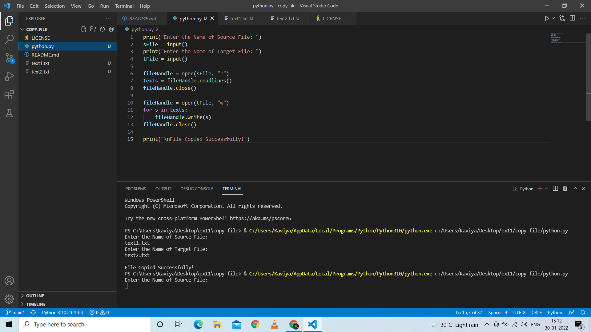
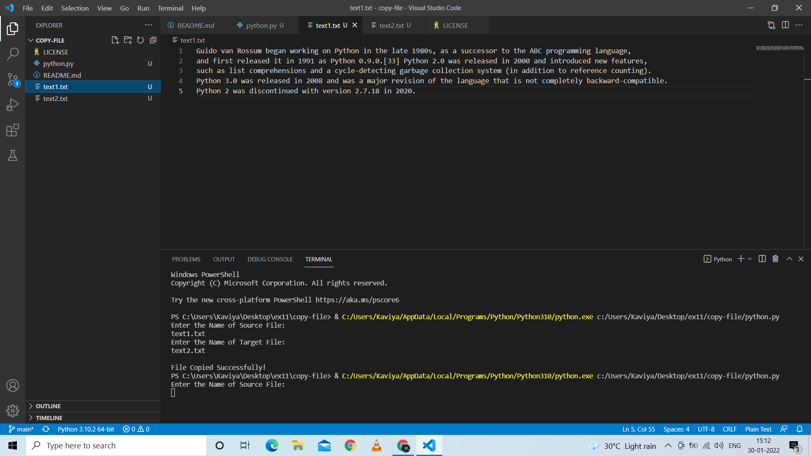

# copy-file
## AIM:
To write a python program for copying the contents from one file to another file.
## EQUIPEMENT'S REQUIRED: 
PC
Anaconda - Python 3.7
## ALGORITHM: 
### Step 1:
Use open function to open the file in which we want to copy from and access it in read mode.

### Step 2:
Read the file and store in a variable.

### Step 3:
Now create a new file in which we want to paste the content using write access mode.

### Step 4:
Use write function to copy the read file that has been stored in the variable.

### Step 5:
The content in the original file will be copied in the new file.

### Step 6:
End the program.
## PROGRAM:
~~~
print("Enter the Name of Source File: ")
sFile = input()
print("Enter the Name of Target File: ")
tFile = input()

fileHandle = open(sFile, "r")
texts = fileHandle.readlines()
fileHandle.close()

fileHandle = open(tFile, "w")
for s in texts:
    fileHandle.write(s)
fileHandle.close()

print("\nFile Copied Successfully!")
~~~
### OUTPUT:

## RESULT:
Thus the program is written to copy the contents from one file to another file.
